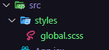

# Utilizando SASS

[  ](https://sass-lang.com/)

1. Install `yarn add sass-loader -D`

2. Add no arquivo "webpack.config.js" em rules 'sass-loader':

    ```js
        module: {
            rules: [
                ...
                {
                    test: /\.scss$/,
                    exclude: /node_modules/,
                    use: ['style-loader', 'css-loader', 'sass-loader'], // add
                }
            ],
        }
    ```

3. Install `yarn add node-sass -D`

4. Trocar a extensão do arquivo "global.css" para "global.scss" na pasta "styles". E também no arquivo "App.jsx" alterar a extensão na importação:

    

    ```js
        import './styles/global.css'; para import './styles/global.scss';
    ```

`yarn dev`

